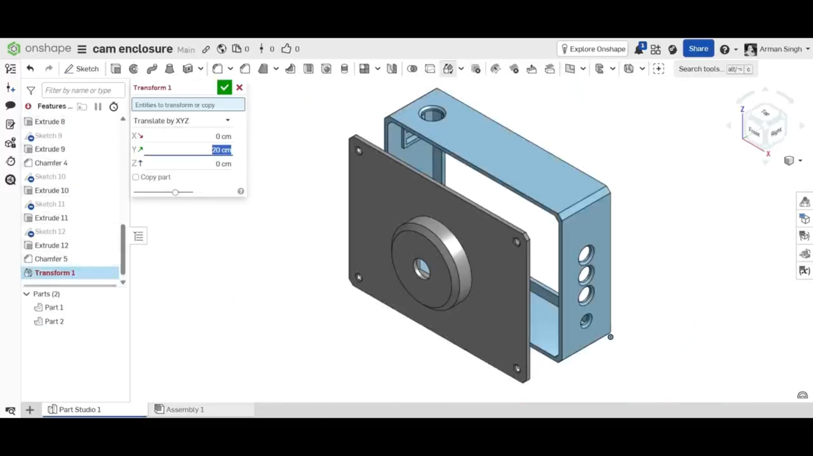
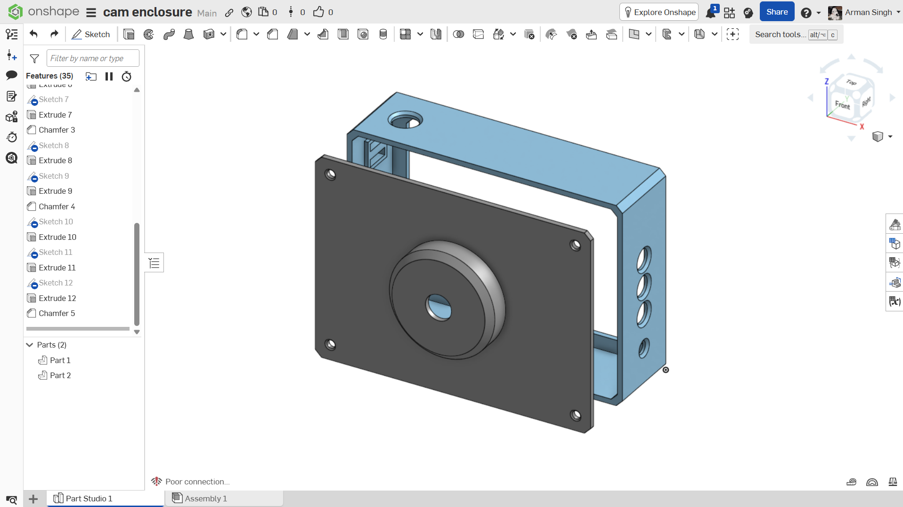
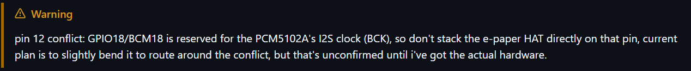

# August 24: enclosure design + figured out the wiring

started with the enclosure in onshape, kept it simple box, camera facing front like an actual camera, e-paper on the back. spent most of the time just reading through pi zero 2w's pinout docs tbh, then created custom wiring for it on KiCad.

lapse:

[Custom wiring](https://lapse.hackclub.com/timelapse/ZLN3MLDVRYlK)

[Enclosure design session 1](https://lapse.hackclub.com/timelapse/OsgH9Q1qcdcQ)

[Enclosure design session 2](https://lapse.hackclub.com/timelapse/gx-nGCOcEONJ)

**Total time spent: 2h**

# August 28: dropped pisugar, added real component models in CAD

pisugar out and switched to my own diy power management instead. then imported actual component models to see everything fits and then finalized the design. lowk messed up while creating the custom wiring of v2, but worked off camera to fix it (time not logged)

lapse:

[Added display and mcu components](https://lapse.hackclub.com/timelapse/gCPrfr4si9X2)

[Added remaining components](https://lapse.hackclub.com/timelapse/kuFXo-qOWnxr)

[Final assembly](https://lapse.hackclub.com/timelapse/12oG5774p69Q)

[Messed up session](https://lapse.hackclub.com/timelapse/DcNPoA9z2mz1)

**Total time spent: 8h**

# September 4: readme pass + found a pin conflict

spent most of this session rewriting the readme properly. while writing out the i noticed gpio18 pin conflict: e-paper HAT wants it for PWR (fixed since it's a direct stack, can't reroute in software), and the DAC also needs it for i2s clock (BCK). since i2s pins are fixed in hardware, this one isn't a simple fix. plan rn is to slightly bend that pin on the HAT and route it elsewhere once i've actually got the hardware.

**Total time spent: 2h 14m**