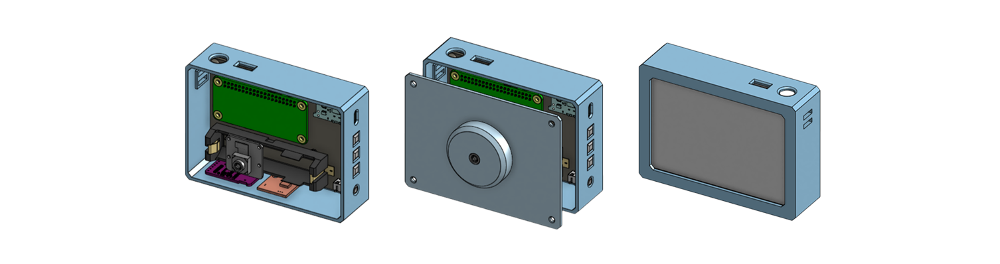

# e-paper camera
A camera that remembers only one photo (on screen at least), and works as an mp3 player too (cuz why not).

## What is it
wanted a digicam for a while, but the old ones are unreliable (& expensive ofc) and new cheap ones are just junk. so i decided to build one myself. i also wanted an mp3 player, totally different itch. since i was already building custom hardware for the camera, figured why not squeeze that in too (big brain)

**ok here's what it actually does:**  
there's no gallery, no scrolling, the e-paper just shows your last shot and it stays there forever until next shot. every pic still gets saved properly though, and it wifi backs up to laptop/phone in the background the second photo is taken, nothing ever actually gets lost even though the screen only shows the one pic (you can change which pic shows from the phone/laptop dashboard too).

## Electronics
| Parts | Desc |
| --- | --- |
| Waveshare 4inch e-Paper HAT+ (Spectra 6, color) | main display board, e-paper is needed to fulfill that "last pic stays permanently" concept |
| Raspberry Pi Zero 2 W | mcu, only board with enough hardware to handle everything, more mentioned in QnA below |
| Raspberry Pi Camera Module 3 | camera unit, pi cam module 2 could be used too but didn't want to compromise on image quality |
| Raspberry Pi Zero CSI Camera Cable | pi zero's csi port is smaller than cam module 3's stock cable so needed this to connect them |
| 18650 Li-ion Cell (Molicel INR-18650-P30B) | battery cell, picked this specific one for enough capacity and physical fit in the enclosure
| 18650 Cell Holder | house for the cell |
| TP4056 Charging Module | needed for charging the cell over usb c with overcharge/overcurrent protection |
| MT3608 Step Up Module | boosts the cell's output to stable 5V which will be used by Pi, PCM5102A DAC, and TDA1308 amp |
| Latching Power Switch (SPST) | physical on/off button |
| PCM5102A I2S DAC Module | handles the actual mp3 audio output |
| TDA1308 Amplifier Module | DAC's line level audio output isn't enough for clean headphone quality, so this stage would boost it for better quality |
| MicroSD Card (32GB) | storage for both music library and photos |
| Buttons x4 (Shutter & Music Controls) | 1 shutter button + 3 music control buttons |
| Hookup Wire & Jumper Cables | wiring between modules (no custom PCB. please see note below) |
| M3 Screws | for the enclosure |

## Wiring
> [!NOTE]
>  this schematic shows the wiring which would be done by using jumping wires, there's no custom pcb design proposed yet, so no board screenshot or 3D render to show. If the wiring gets messy, i would consider designing a custom pcb and upload it exactly here :) 

> [!WARNING]
> pin 12 conflict: GPIO18/BCM18 is reserved for the PCM5102A's I2S clock (BCK), so don't stack the e-paper HAT directly on that pin, current plan is to slightly bend it to route around the conflict, but that's unconfirmed until i've got the actual hardware.

## Enclosure

## CAD Model
**Complete CAD model is available on [ONSHAPE](https://cad.onshape.com/documents/ab0129b0ffcb553a41fd978a/w/1af2f7c9bc0d2e8a4e4feb4b/e/cccda6b71561c05696152eb3?renderMode=0&uiState=6a9196cf4e41288969f92849)**

## Status
schematic and enclosure done, did not start building yet

## QnA

### why pi zero 2 w and not esp32?
this is the one part i'm not swapping for something cheaper, and it's not because the pi's just convenient, but the pi actually earns its spot because this thing needs to do a bunch of stuff at the same time that a microcontroller straight up can't

1. **camera res**: cam module 3 does 13MP, best an esp32 can pair with is like 5MP.
2. **ram for the e-paper buffer**: the spectra 6 display needs a chunky memory buffer just to process one image before it even renders. an esp32 doesn't have room for that, especially with music also playing.
3. **actual multitasking**: taking a high res photo, dithering + rendering it to e-paper, pushing it out over wifi, decoding mp3s, and checking 4 buttons, all at once. that's real OS scheduling, a microcontroller just chokes once audio and image stuff overlap.
4. **networking + storage**: wifi backup plus a whole photo + music library on one sd card is nothing on linux. on a microcontroller i'd be writing wifi stack and flash/FAT handling from scratch for a worse result.

### why added TDA1308 Amplifier?
PCM5102A outputs line level audio, not enough to drive headphones cleanly. Without the extra amp stage, there would be weak volume and/or audio quality issues.

TDA1308 is specifically built for this. it's literally specified as a headphone driver stage

### how long the battery would last?
there are two real world scenarios:
1. idle/music playback: Pi ~130mA  + DAC ~20mA + amp ~20mA + e-paper standby ~0mA ≈ ~170mA
2. photo capture: Pi under load (~500mA) + camera (~250mA) + e-paper refresh (~14mA) ≈ ~760mA

the battery is 2850 mAh @3.6v = 10.26Wh

then through the boost converter (3.6V to 5V, ~85% efficiency):  
usable energy at 5V = 10.26Wh × 0.85 ≈ 8.72Wh  
effective capacity at 5V = 8.72Wh ÷ 5V ≈ 1744mAh

this means:
1. idle/music playback: 1744mAh ÷ 170mA ≈ 10.3 hrs of continuous music playback
2. photo capture: this ~760mA is just a few seconds spike per shot, so the overall battery life is still around or just slight (~30 mins) less than 10.3 hrs

NOTE: the power usage of each component are estimates from various sources, will swap in real multimeter readings once built.

## Credits
not a clone of [reFrame](https://github.com/kaloyaan/reframe), though that's what got me thinking about this