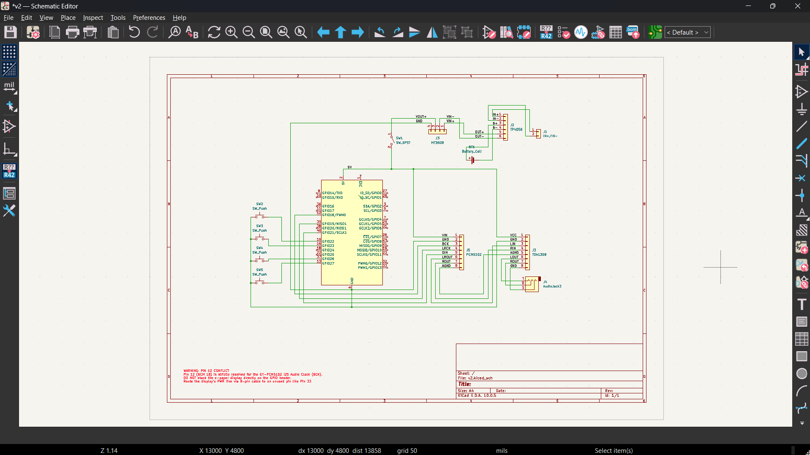
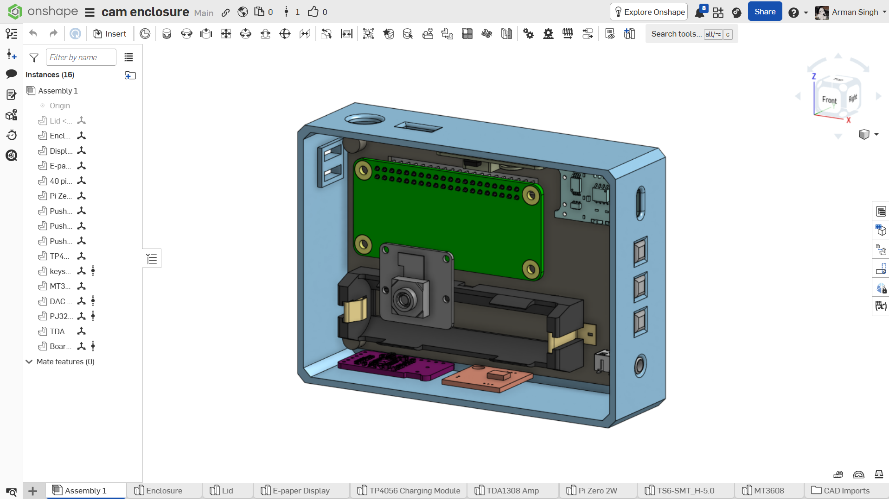

# pi-camera-proj
a camera that only remembers one photo (on screen at least), with an mp3 player crammed in too (cuz why not)

## what is it
wanted a digicam and an mp3 player for a while now, then it hit me that i could just build both myself. was gonna keep it simple but the idea kept snowballing, so now it's one box doing both jobs. 
no gallery, no scrolling, the e-paper just shows your last shot and it stays there forever until next shot. every pic still gets saved properly though, and it wifi backs up to your laptop/phone in the background the second you take it, no cable needed, nothing ever actually gets lost even though the screen only shows the one pic (you can change which pic shows from the phone/laptop dashboard too).

### why pi zero 2 w and not esp32
this is the one part i'm not swapping for something cheaper, and it's not because the pi's just convenient. everything else in this build already got stripped down to bare parts (more on that below), but the pi actually earns its spot because this thing needs to do a bunch of stuff at the same time that a microcontroller straight up can't

1. **camera res**: cam module 3 does 13MP, best an esp32 can pair with is like 5MP. that's the diff between a photo worth keeping and a blurry mess.
2. **ram for the e-paper buffer**: the spectra 6 display needs a chunky memory buffer just to process one image before it even renders. an esp32 doesn't have room for that, especially with music also playing.
3. **actual multitasking**: taking a high res photo, dithering + rendering it to e-paper, pushing it out over wifi, decoding mp3s, and checking 4 buttons, all at once. that's real OS scheduling, a microcontroller just chokes once audio and image stuff overlap.
4. **networking + storage**: wifi backup plus a whole photo + music library on one sd card is nothing on linux. on a microcontroller i'd be writing wifi stack and flash/FAT handling from scratch for a worse result.

power and audio though, those i did rip out the premade modules for and build myself, that's where the actual cost got cut.

## electronics

| Parts |
| --- |
| Waveshare 4inch e-Paper HAT+ (Spectra 6, color) |
| Raspberry Pi Zero 2 W |
| Raspberry Pi Camera Module 3 |
| Raspberry Pi Zero CSI Camera Cable |
| 18650 Li-ion Cell (Molicel INR-18650-P30B) |
| 18650 Cell Holder |
| TP4056 Charging Module |
| MT3608 Step Up Module |
| Latching Power Switch (SPST) |
| PCM5102A I2S DAC Module |
| TDA1308 Amplifier Module |
| MicroSD Card (32GB) |
| Buttons x4 (Shutter & Music Controls) |
| Hookup Wire & Jumper Cables |
| M3 Screws |

## wiring

## enclosure
[---------------CAD MODEL HERE---------------](https://cad.onshape.com/documents/ab0129b0ffcb553a41fd978a/w/1af2f7c9bc0d2e8a4e4feb4b/e/cccda6b71561c05696152eb3?renderMode=0&uiState=6a9196cf4e41288969f92849)

## status
schematic and enclosure done, did not start building yet

## credits
not a clone of [reFrame](https://github.com/kaloyaan/reframe), though that's what got me thinking about this